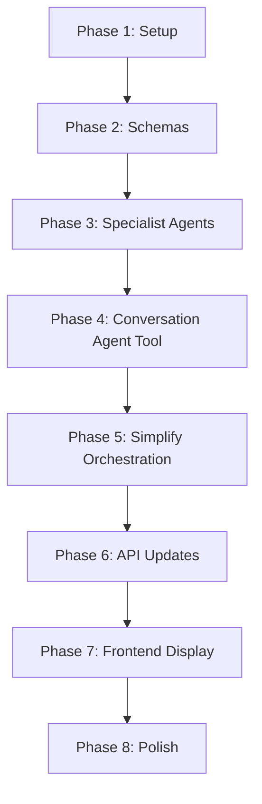

# Tasks: AI Agent Architecture Redesign - Function Tool Orchestration

**Feature**: 001-ai-fitness-planner (Architecture Improvement)  
**Date**: 2025-11-19  
**Status**: Ready for Implementation  
**Branch**: `feature/agent-redesign-function-tools`

---

## Overview

This document outlines the implementation tasks to redesign the AI agent conversation management system. The new architecture makes the **Conversation Agent the orchestrator** using OpenAI function tools, eliminating manual agent switching logic.

### Key Architecture Changes

**Current Architecture** (Manual Orchestration):
```
AIOrchestrationService → manually switches between agents
├── Conversation Agent (requirement extraction)
├── Fitness Plan Agent (coordinates plan generation)
│   ├── Workout Plan Agent (exercise selection)
│   └── Meal Plan Agent (meal generation)
```

**New Architecture** (Function Tool-Based Orchestration):
```
Conversation Agent (orchestrator with function tools)
├── build_fitness_plan() tool → calls Fitness Plan Agent
│   ├── Fitness Plan Agent with function tools:
│   │   ├── build_workout_plan() tool → Workout Plan Agent
│   │   └── build_meal_plan() tool → Meal Plan Agent
│   └── Returns structured FitnessPlan with pydantic models
└── Other tools: get_current_plan, update_plan, reschedule, etc.
```

### Benefits

1. **Simplified Control Flow**: Conversation agent decides when to generate plans via function calls
2. **Automatic Context Management**: OpenAI handles when to call tools vs continue conversation
3. **Better User Experience**: Plans are automatically formatted nicely in chat and on plan page
4. **Structured Output**: Pydantic models ensure consistent plan data structure
5. **No Manual Agent Switching**: Eliminates complex orchestration service logic

---

## Implementation Strategy

### Approach: Incremental Refactoring

- **Phase 1 (Setup)**: Update dependencies, configure function tools infrastructure
- **Phase 2 (Foundational)**: Create pydantic output schemas, refactor agent structure
- **Phase 3 (Core Implementation)**: Implement function tools for each agent, update conversation agent
- **Phase 4 (Integration)**: Update API endpoints, frontend display, testing
- **Phase 5 (Polish)**: Remove old orchestration code, optimize, document

### Execution Principles

- Test after each major task to ensure functionality
- Keep existing code working during refactor (feature flags if needed)
- Use type hints and pydantic models for all structured data
- Follow TDD: write tests before implementation where critical

---

## Phase 1: Setup & Dependencies

**Goal**: Prepare environment and infrastructure for function tool-based architecture

### Tasks

- [ ] T001 Verify OpenAI Agents SDK version supports function tools in backend/requirements.txt
- [ ] T002 [P] Create backup branch of current agent implementation for rollback safety
- [ ] T003 [P] Update backend/src/ai/schemas.py to include all pydantic output models (FitnessPlanOutput, WorkoutPlanOutput, MealPlanOutput)
- [ ] T004 [P] Add function tool configuration settings to backend/src/config.py

**Completion Criteria**: All dependencies verified, schemas ready, config updated

---

## Phase 2: Foundational - Pydantic Output Schemas

**Goal**: Define structured output models for all agent responses

### Tasks

- [ ] T005 [P] Define WorkoutPlanOutput pydantic model in backend/src/ai/schemas.py with exercises, sets, reps, schedule
- [ ] T006 [P] Define MealPlanOutput pydantic model in backend/src/ai/schemas.py with meals, calories, macros, timing
- [ ] T007 [P] Update FitnessPlanOutput pydantic model in backend/src/ai/schemas.py to include nested WorkoutPlanOutput and MealPlanOutput
- [ ] T008 [P] Add validation methods to schemas to ensure plan completeness (e.g., validate workout frequency matches plan duration)
- [ ] T009 Write unit tests for pydantic schema validation in backend/tests/unit/ai/test_schemas.py

**Completion Criteria**: All schemas defined with validation, tests passing

---

## Phase 3: User Story 1 - Implement Function Tools for Specialist Agents

**Goal**: Convert specialist agents (Workout, Meal, Fitness Plan) to use structured pydantic outputs and prepare for function tool calls

**Why this priority**: This establishes the foundation for the tool-based architecture. The specialist agents must work correctly with structured outputs before the conversation agent can call them.

**Independent Test**: Can call workout_plan_agent and meal_plan_agent directly with requirements dict, verify they return valid pydantic WorkoutPlanOutput and MealPlanOutput objects.

### Tasks

- [ ] T010 [US1] Update workout_plan_agent in backend/src/ai/app_agents/workout_plan_agent.py to use WorkoutPlanOutput as output_type
- [ ] T011 [US1] Update meal_plan_agent in backend/src/ai/app_agents/meal_plan_agent.py to use MealPlanOutput as output_type
- [ ] T012 [US1] Create build_workout_plan function tool in backend/src/ai/tools/plan_tools.py that calls workout_plan_agent
- [ ] T013 [US1] Create build_meal_plan function tool in backend/src/ai/tools/plan_tools.py that calls meal_plan_agent
- [ ] T014 [US1] Update fitness_plan_agent in backend/src/ai/app_agents/fitness_plan_agent.py to register build_workout_plan and build_meal_plan as function tools
- [ ] T015 [US1] Write integration tests in backend/tests/integration/test_specialist_agents.py to verify workout and meal agents return structured outputs
- [ ] T016 [US1] Write integration test in backend/tests/integration/test_fitness_plan_agent.py to verify fitness plan agent calls tools correctly

**Completion Criteria**: Specialist agents return structured pydantic outputs, fitness plan agent can call them via function tools, all tests passing

---

## Phase 4: User Story 2 - Implement build_fitness_plan Tool for Conversation Agent

**Goal**: Create the main build_fitness_plan function tool that the conversation agent will call to orchestrate complete plan generation

**Why this priority**: This is the core of the new architecture - the conversation agent needs this tool to generate plans when ready. Without this, we can't complete the orchestrator pattern.

**Independent Test**: Can call build_fitness_plan tool directly with user requirements, verify it coordinates fitness_plan_agent which calls workout and meal agents, returns complete FitnessPlanOutput.

### Tasks

- [ ] T017 [US2] Create build_fitness_plan function tool in backend/src/ai/tools/plan_tools.py that coordinates fitness_plan_agent
- [ ] T018 [US2] Implement database persistence logic in build_fitness_plan tool to save FitnessPlanOutput to backend/src/models/fitness_plan.py
- [ ] T019 [US2] Add helper function in backend/src/ai/tools/plan_tools.py to extract requirements dict from conversation context
- [ ] T020 [US2] Update conversation_agent in backend/src/ai/app_agents/conversation_agent.py to register build_fitness_plan as function tool
- [ ] T021 [US2] Update conversation_agent instructions in backend/src/ai/app_agents/conversation_agent.py to describe when to call build_fitness_plan tool
- [ ] T022 [US2] Write integration test in backend/tests/integration/test_plan_tools.py to verify build_fitness_plan tool end-to-end
- [ ] T023 [US2] Write integration test in backend/tests/integration/test_conversation_agent_tools.py to verify conversation agent calls build_fitness_plan when ready

**Completion Criteria**: Conversation agent can automatically call build_fitness_plan tool when requirements gathered, plan saved to database, tests passing

---

## Phase 5: User Story 3 - Simplify AIOrchestrationService

**Goal**: Refactor AIOrchestrationService to remove manual agent switching logic and let conversation agent handle orchestration via function tools

**Why this priority**: Now that function tools work, we can simplify the orchestration service to just manage conversation flow and let the conversation agent decide when to generate plans.

**Independent Test**: Can start conversation, send messages, verify conversation agent automatically calls build_fitness_plan when ready without manual orchestration logic.

### Tasks

- [ ] T024 [US3] Refactor AIOrchestrationService.start_conversation in backend/src/services/ai_service.py to only use conversation_agent
- [ ] T025 [US3] Refactor AIOrchestrationService.continue_conversation in backend/src/services/ai_service.py to remove manual requirement checking logic
- [ ] T026 [US3] Remove deprecated generate_plan method from AIOrchestrationService in backend/src/services/ai_service.py
- [ ] T027 [US3] Remove _check_requirements_complete helper method from AIOrchestrationService in backend/src/services/ai_service.py
- [ ] T028 [US3] Remove _extract_requirements_from_conversation helper method from AIOrchestrationService in backend/src/services/ai_service.py
- [ ] T029 [US3] Remove _generate_structured_plan helper method from AIOrchestrationService in backend/src/services/ai_service.py
- [ ] T030 [US3] Update AIOrchestrationService to detect when conversation_agent called build_fitness_plan tool and extract plan_id from result
- [ ] T031 [US3] Write integration tests in backend/tests/integration/test_ai_service_refactored.py for simplified orchestration service

**Completion Criteria**: AIOrchestrationService simplified, no manual agent switching, conversation agent handles orchestration, tests passing

---

## Phase 6: User Story 4 - Update API Endpoints

**Goal**: Update backend API endpoints to work with simplified orchestration service and return plan data in format frontend expects

**Why this priority**: API layer needs to understand new response format from conversation agent with function tool results and provide properly formatted plan data.

**Independent Test**: Can call API endpoints via curl/httpx, verify conversation automatically generates plan when ready, plan_id returned in response, plan details accessible.

### Tasks

- [ ] T032 [US4] Update start_conversation endpoint in backend/src/api/v1/ai_agent.py to handle function tool results in response
- [ ] T033 [US4] Update send_message endpoint in backend/src/api/v1/ai_agent.py to detect plan generation and include plan_id in response
- [ ] T034 [US4] Remove deprecated generate_plan endpoint from backend/src/api/v1/ai_agent.py (no longer needed with automatic generation)
- [ ] T035 [US4] Add get_plan_details endpoint in backend/src/api/v1/fitness_plans.py to retrieve formatted plan for display
- [ ] T036 [US4] Update ConversationResponse schema in backend/src/api/v1/ai_agent.py to include optional plan_id and plan_summary fields
- [ ] T037 [US4] Write API contract tests in backend/tests/contract/test_ai_agent_api.py for updated endpoints
- [ ] T038 [US4] Update API documentation in backend/docs/api-guide.md to reflect new conversation flow with automatic plan generation

**Completion Criteria**: API endpoints updated, automatic plan generation working via API, contract tests passing, documentation updated

---

## Phase 7: User Story 5 - Frontend Display & Formatting

**Goal**: Update frontend to display AI-generated plans nicely in both chat interface and plan page with all details visible

**Why this priority**: Users need to see their generated plans in a clear, actionable format. This delivers the user-facing value of the architecture redesign.

**Independent Test**: Can start conversation in frontend, see plan automatically generated in chat with nice formatting, navigate to plan page and see full details (phases, workouts, meals, schedule).

### Tasks

- [ ] T039 [US5] Create PlanSummaryCard component in frontend/src/components/fitness/plan-summary-card.tsx to display plan overview in chat
- [ ] T040 [US5] Create WorkoutDetailsList component in frontend/src/components/fitness/workout-details-list.tsx to show exercises, sets, reps
- [ ] T041 [US5] Create MealDetailsList component in frontend/src/components/fitness/meal-details-list.tsx to show meals, calories, macros
- [ ] T042 [US5] Update chat message rendering in frontend/src/components/chat/message-list.tsx to detect plan generation and render PlanSummaryCard
- [ ] T043 [US5] Update plan page in frontend/src/app/dashboard/plan/page.tsx to fetch and display full plan details with WorkoutDetailsList and MealDetailsList
- [ ] T044 [US5] Add loading states and error handling in frontend/src/components/chat/chat-interface.tsx for plan generation
- [ ] T045 [US5] Write component tests in frontend/tests/components/plan-display.test.tsx for plan display components
- [ ] T046 [US5] Write E2E test in frontend/tests/e2e/plan-generation.spec.ts to verify complete flow from conversation to plan display

**Completion Criteria**: Plans display nicely in chat and plan page, all workout/meal details visible, loading states work, tests passing

---

## Phase 8: Polish & Documentation

**Goal**: Clean up deprecated code, optimize performance, and document the new architecture

### Tasks

- [ ] T047 [P] Remove old manual orchestration logic that's no longer used from backend/src/services/ai_service.py
- [ ] T048 [P] Remove deprecated _is_plan_generated helper method from backend/src/services/ai_service.py
- [ ] T049 [P] Remove deprecated _parse_plan_result helper method from backend/src/services/ai_service.py
- [ ] T050 [P] Update architecture documentation in backend/docs/architecture.md to describe new function tool-based orchestration
- [ ] T051 [P] Add sequence diagrams to backend/docs/architecture.md showing conversation → build_fitness_plan → workout/meal agents flow
- [ ] T052 [P] Update developer quickstart in specs/001-ai-fitness-planner/quickstart.md with examples of testing function tools
- [ ] T053 [P] Add code comments in backend/src/ai/app_agents/conversation_agent.py explaining function tool orchestration pattern
- [ ] T054 [P] Run full test suite (backend pytest --cov, frontend npm test, E2E tests) and verify 80%+ coverage maintained
- [ ] T055 Run linting and formatting (backend ruff + black, frontend eslint + prettier) and fix any issues
- [ ] T056 Create migration guide document in specs/001-ai-fitness-planner/migration-guide.md for developers to understand architecture changes

**Completion Criteria**: All deprecated code removed, documentation updated, tests passing with good coverage, linting clean

---

## Dependencies & Execution Order

### Critical Path (Sequential Execution Required)



### Parallel Execution Opportunities

**Within Phase 1** (all parallel):
- T001, T002, T003, T004 can run simultaneously

**Within Phase 2** (mostly parallel):
- T005, T006, T007, T008 can run in parallel (schema definitions)
- T009 depends on T005-T008 (tests need schemas)

**Within Phase 3** (some parallelization):
- T010 and T011 can run in parallel (update agents)
- T012 and T013 can run in parallel (create tools)
- T014 depends on T010-T013
- T015 and T016 can run in parallel (tests)

**Within Phase 4** (sequential due to dependencies):
- T017-T019 should run in order
- T020-T021 can run in parallel
- T022-T023 can run in parallel (tests)

**Within Phase 5** (mostly sequential):
- T024-T029 should run in order (refactoring)
- T030-T031 can run together

**Within Phase 6** (some parallelization):
- T032-T034 should run in order (API changes)
- T035 can run in parallel with T032-T034
- T036-T038 can run in parallel (docs and tests)

**Within Phase 7** (significant parallelization):
- T039, T040, T041 can run in parallel (component creation)
- T042-T043 depend on T039-T041
- T044 can run in parallel with T042-T043
- T045-T046 can run in parallel (tests)

**Within Phase 8** (significant parallelization):
- T047-T049 can run in parallel (code cleanup)
- T050-T053 can run in parallel (documentation)
- T054 depends on all code tasks
- T055-T056 can run in parallel

### Suggested MVP Scope

**Minimum Viable Product** (deliver value quickly):
- Phase 1: Setup (required foundation)
- Phase 2: Schemas (required for structured output)
- Phase 3: Specialist Agents (US1 - core functionality)
- Phase 4: Conversation Agent Tool (US2 - orchestration)
- Phase 5: Simplify Orchestration (US3 - complete refactor)

**Stop here for MVP testing** - this delivers the core architecture redesign with working plan generation.

**Post-MVP Enhancements**:
- Phase 6: API Updates (US4 - better API interface)
- Phase 7: Frontend Display (US5 - improved UX)
- Phase 8: Polish (cleanup and documentation)

---

## Validation Checklist

Before considering this feature complete, verify:

### Functional Requirements
- [ ] Conversation agent acts as orchestrator (no manual switching)
- [ ] Conversation agent calls build_fitness_plan tool when requirements gathered
- [ ] build_fitness_plan tool coordinates fitness_plan_agent
- [ ] fitness_plan_agent calls build_workout_plan and build_meal_plan tools
- [ ] Specialist agents return structured pydantic outputs
- [ ] Plans saved to database with all details
- [ ] Plans display nicely in chat interface
- [ ] Plans display with full details on plan page

### Architecture Quality
- [ ] No manual agent switching logic in orchestration service
- [ ] All agent communication via function tools
- [ ] Pydantic models used for all structured data
- [ ] Type hints on all functions
- [ ] Clear separation of concerns (agents, tools, services, API)

### Testing
- [ ] Unit tests for pydantic schemas
- [ ] Integration tests for specialist agents
- [ ] Integration tests for function tools
- [ ] Integration tests for conversation agent
- [ ] API contract tests
- [ ] Frontend component tests
- [ ] E2E test for complete flow
- [ ] Test coverage >= 80% overall, 100% for critical paths

### Documentation
- [ ] Architecture diagram updated
- [ ] Sequence diagrams added
- [ ] API documentation updated
- [ ] Developer quickstart updated
- [ ] Code comments in key areas
- [ ] Migration guide created

### Code Quality
- [ ] All linting passing (ruff, black, eslint, prettier)
- [ ] No deprecated code remaining
- [ ] Type checking passing (mypy, tsc)
- [ ] No console warnings or errors

---

## Summary Statistics

### Task Breakdown
- **Total Tasks**: 56
- **Phase 1 (Setup)**: 4 tasks (all parallel)
- **Phase 2 (Foundational)**: 5 tasks
- **Phase 3 (US1 - Specialist Agents)**: 7 tasks
- **Phase 4 (US2 - Orchestrator Tool)**: 7 tasks
- **Phase 5 (US3 - Simplify Service)**: 8 tasks
- **Phase 6 (US4 - API Updates)**: 7 tasks
- **Phase 7 (US5 - Frontend Display)**: 8 tasks
- **Phase 8 (Polish)**: 10 tasks

### Parallel Opportunities
- **High Parallelization** (5+ tasks): Phase 7 (8 parallel), Phase 8 (7 parallel)
- **Medium Parallelization** (3-4 tasks): Phase 1 (4 parallel), Phase 2 (4 parallel), Phase 3 (4 parallel)
- **Low Parallelization** (1-2 tasks): Phase 4 (2 parallel), Phase 5 (2 parallel), Phase 6 (3 parallel)

### Estimated Timeline (with 2 developers)
- **MVP (Phases 1-5)**: ~2-3 weeks
- **Full Implementation (Phases 1-8)**: ~4-5 weeks

### Key Benefits
1. **Simplified Architecture**: Removes ~200 lines of manual orchestration logic
2. **Automatic Orchestration**: Conversation agent decides when to call tools
3. **Better Structured Output**: Pydantic models ensure consistency
4. **Improved UX**: Plans formatted nicely in chat and on plan page
5. **Easier to Extend**: Add new tools without changing orchestration logic

---

## Notes

- Keep existing API endpoints working during refactor for backward compatibility
- Use feature flags if needed to toggle between old and new architecture during transition
- Test thoroughly at each phase boundary before proceeding
- Document any deviations from this plan in migration-guide.md
- Celebrate when build_fitness_plan tool successfully generates first complete plan! 🎉

---

**Ready to start implementation!** Begin with Phase 1 (Setup) tasks and work through each phase sequentially, leveraging parallel opportunities within each phase.
